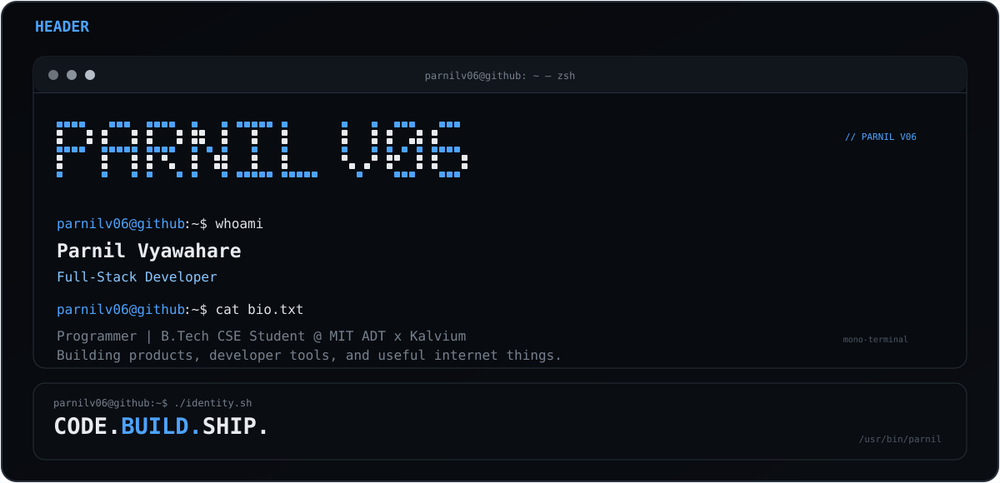
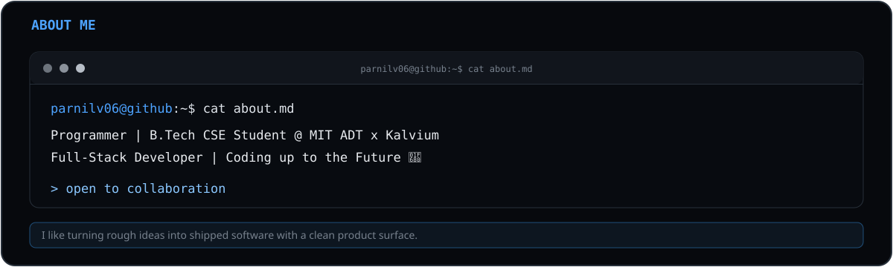
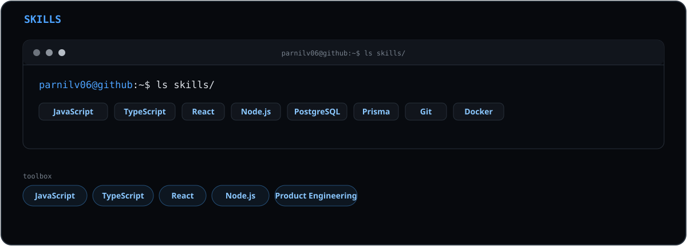
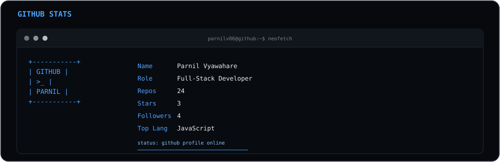
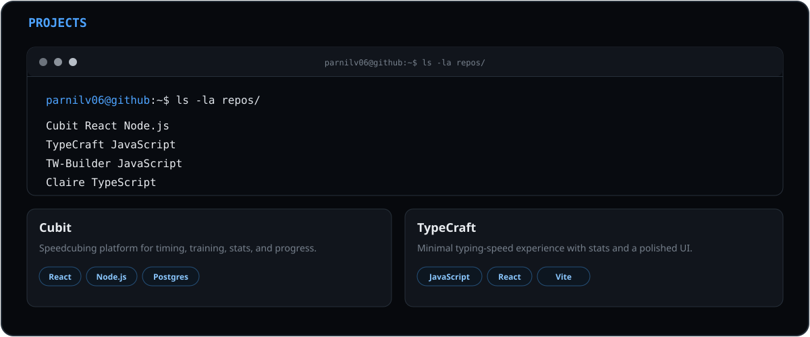
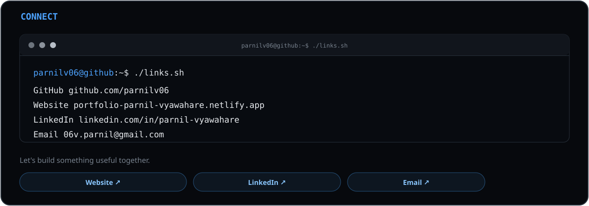
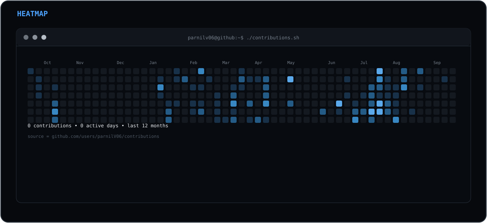

<!-- MONO TERMINAL GITHUB PROFILE
Copy this README.md into your GitHub profile repository and keep assets/ beside it.
The heatmap is generated from GitHub's real contribution calendar by .github/workflows/update-heatmap.yml. It runs on the first push and then daily. -->

  

  

  

  

  

  

  

## Parnil Vyawahare

Full-stack developer building products, experiments, and developer tools.

- GitHub: [@parnilv06](https://github.com/parnilv06)
- Portfolio: [portfolio-parnil-vyawahare.netlify.app](https://portfolio-parnil-vyawahare.netlify.app/)
- LinkedIn: [parnil-vyawahare](https://www.linkedin.com/in/parnil-vyawahare/)
- Email: [06v.parnil@gmail.com](mailto:06v.parnil@gmail.com)
